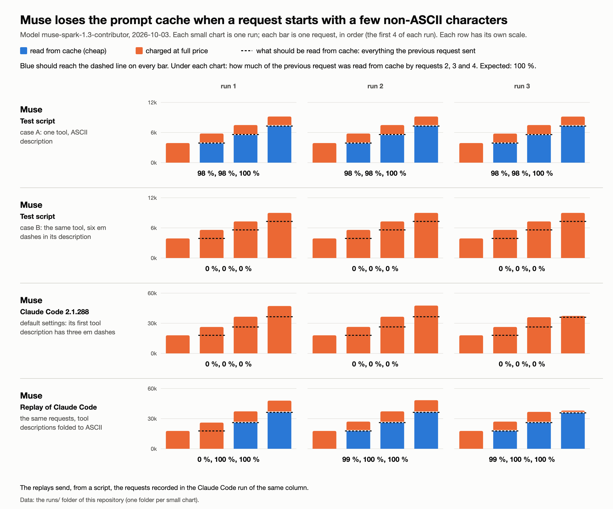

# Muse loses the prompt cache when a few non-ASCII characters appear in the first 4 096 characters of a request

Model `muse-spark-1.3-contributor`, endpoint `https://api.meta.ai/v1/messages`, tested on 2026-10-03.



Words used here: a **request** is one call to `/v1/messages`; the **prompt cache** lets a request
read again, at a lower price, what the previous request of the same conversation already sent.

## The shortest proof

A test script ([`repro-nonascii.py`](repro-nonascii.py), no Claude Code involved) sends the same growing
conversation of four requests, six times. Only the place and number of em dashes (`—`, U+2014)
change. Expected: requests 2 to 4 read the previous request from cache. Muse counts cache reads in
blocks of 128 tokens, so a full read shows as 97 to 100 %.

Read from cache by requests 2, 3 and 4, in three runs:

| case | run 1 | run 2 | run 3 |
|---|---|---|---|
| A. one tool, ASCII description | 98 %, 98 %, 100 % | 98 %, 98 %, 100 % | 98 %, 98 %, 100 % |
| B. same tool, six em dashes in its description | **0 %, 0 %, 0 %** | **0 %, 0 %, 0 %** | **0 %, 0 %, 0 %** |
| C. same tool, one em dash | 98 %, 98 %, 100 % | 98 %, 98 %, 100 % | 98 %, 98 %, 100 % |
| D. no tool, six em dashes at character 100 of the system prompt | **0 %, 0 %, 0 %** | 97 %, **0 %, 0 %** | **0 %, 0 %, 0 %** |
| E. no tool, the same six em dashes at character 5 000 of the system prompt | 97 %, 98 %, 100 % | 97 %, 98 %, **0 %** | 98 %, 98 %, 100 % |
| F. case A without any `cache_control` marker | **0 %, 0 %, 0 %** | **0 %, 0 %, 0 %** | **0 %, 0 %, 0 %** |

The two exceptions, both in run 2, show that a healthy request also misses now and then, and that a
failing one is now and then read. Raw requests, responses and request ids:
[`runs/nonascii_muse_1`](runs/nonascii_muse_1/), `_2`, `_3` (2026-10-03, 16:57 to 17:03 UTC).

## What we measured, from the outside

- **Only about the first 4 096 characters of a request matter**, counted over the tool definitions
  first, then the system prompt, then the messages. Em dashes at character 4 000 of the system
  prompt: 0 %; at character 4 400: 100 %.
- **One em dash is fine, two are not** (0 of 15 requests read). Two or three `é` are fine, four are
  not. On these small samples, it looks like a threshold of 4 bytes beyond the character count.
- **When a request misses, it sometimes reads an older request of the same conversation in full**,
  non-ASCII characters included: it looks like the cache entry is there, but not found.
- Sending the body as pure ASCII (the escape `\u2014` instead of `—`) changes nothing.
- Without any `cache_control` marker, nothing is read from cache, even in pure ASCII (case F).

Every measurement, with its request ids: [`DETAILS.md`](DETAILS.md) and [`probes.csv`](probes.csv).

## Why it matters: every Claude Code session is hit

The first tool definition Claude Code sends has three em dashes in its first 900 characters.

- **Claude Code 2.1.288 on Muse**: in four sessions, every request but one reads **0 %** of the previous
  one; the exception reads an older request in full (`runs/claude-code_muse_*`). Its requests are
  append-only (checked with `check-prefix.py`).
- **The same requests replayed by a script, unchanged**: 0 %, apart from one partial read of an older
  request (`runs/replay_muse_*_as-is`).
- **The same replay, with the non-ASCII characters of the tool descriptions replaced by ASCII**
  (`—` becomes `-`, names and schemas unchanged): 12 requests out of 13 read in full
  (`runs/replay_muse_*_ascii-tools`).
- **Three real Claude Code sessions with the same change made by a local relay**: 14 requests out of 14
  read in full, task completed (`runs/claude-code-asciitools_muse_*`).

This used to work. In our own Claude Code sessions on Muse, the median share of the previous request
read from cache was 97.7 to 99.5 % each day from 2026-09-20 to 09-27, 86 % on 09-28 and 0 % on 10-03.
Claude Code was the same version (2.1.283) on 09-27 and 09-28. We have not checked whether its tool
definitions already carried these em dashes before 09-28. Figures from our local session logs:
[`history.csv`](history.csv).

## What we ask

1. Is a cache or routing key for `/v1/messages` computed from the first 4 096 characters of the
   request, and how does it handle multi-byte UTF-8 characters? Request ids (`x-request-id`) of case B,
   which fails, in order: `7d859c06-6916-4bf5-875a-091af4c3e97e`, `df0aca92-a03e-40e2-a3dd-911bd3aa55c2`,
   `5d01dd03-1ca2-456a-a8e3-ddd5a0876a14`, `c3799aae-6183-4f23-9c55-a691c3e742cb`
   (2026-10-03, 16:58:03 to 16:58:12 UTC). Case A, which works:
   `de99b475-3270-4323-9bf0-f422290d49c2`, `e06858c7-0ed9-403e-9a2e-f9c073c1d1d3`,
   `b0b2e1ef-33e8-44dc-a532-15d66b698b48`, `f8c02b39-f080-4a7a-a232-3ee9e2c73bee`
   (16:57:51 to 16:58:00 UTC).
2. Did something change in caching or routing around 2026-09-28?
3. Your prompt caching page says no marker is needed. On `/v1/messages`, a request without any
   `cache_control` marker never reads from cache (case F), and `prompt_cache_key` is refused
   (`400 unknown parameter`, request id `9fea41a2-2ee3-49cb-94ad-ab6ccb0a39d5`,
   [`runs/prompt-cache-key_muse_1`](runs/prompt-cache-key_muse_1/)). Is that intended?

## Reproduce

```
API_KEY=<Muse key> python3 repro-nonascii.py                                     # the six cases
API_KEY=<Muse key> python3 replay.py runs/claude-code_muse_1 out-a as-is         # Claude Code requests: 0 %
API_KEY=<Muse key> python3 replay.py runs/claude-code_muse_1 out-b ascii-tools   # same, tool descriptions in ASCII: read in full
python3 check-prefix.py runs/claude-code_muse_1                                  # each request repeats the previous one
```

Python 3 only, a few cents on Muse.

## More

- [`DETAILS.md`](DETAILS.md): every run, the threshold and window measurements with their request ids,
  and the workaround on real Claude Code sessions.
- [`runs/`](runs/): raw requests, responses and request ids of every run. The folders
  `runs/claude-code_*` and `runs/replay_*` carry Claude Code's own prompt text; they are attached to our
  message and are not in any public copy.
